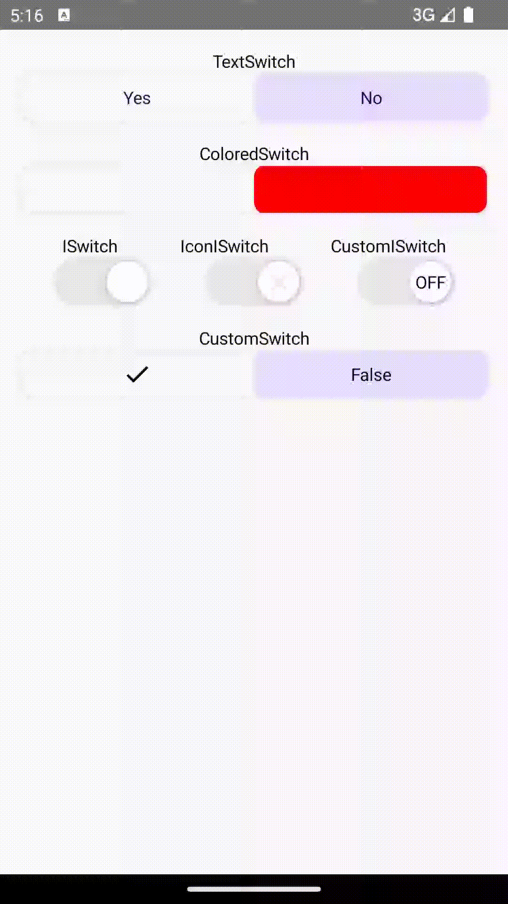

# Switchy Compose

[](https://jitpack.io/#muazkadan/switchy-compose)
[](https://central.sonatype.com/search?q=switchy-compose)
[](https://android-arsenal.com/api?level=21)
[](https://kotlinlang.org/docs/multiplatform.html)
[](https://opensource.org/licenses/Apache-2.0)

A modern, customizable switch component library for Jetpack Compose that provides beautiful animated switches with various styles and configurations, now with multiplatform support!

## 🎬 Preview



## ✨ Features

- **Multiple Switch Variants**: 10 different switch styles to choose from
- **Multiplatform Support**: Works on Android, iOS and Desktop
- **Smooth Animations**: Fluid transitions with customizable duration and easing
- **Highly Customizable**: Colors, shapes, sizes, and content can be tailored to your needs
- **Jetpack Compose Native**: Built specifically for Compose with modern UI patterns
- **Lightweight**: Minimal dependencies and optimized performance
- **Material Design 3**: Follows Material Design guidelines and theming
- **Platform Native Switches**: Use platform-specific native switch implementations

### Available Switch Types

1. **TextSwitch** - Switch with customizable text labels
2. **ColoredSwitch** - Simple colored switch with border
3. **ISwitch** - iOS-style switch with circular thumb
4. **IconISwitch** - iOS-style switch with custom icons
5. **CustomISwitch** - iOS-style switch with custom content
6. **CustomSwitch** - Fully customizable switch with custom content
7. **SquareSwitch** - Modern square-style switch
8. **NativeSwitch** - Platform-specific native switch implementation (Material3 on Android, UIKit on iOS)

## 🛠 Technology Stack

- **Kotlin** - 100% Kotlin
- **Jetpack Compose** - Modern Android UI toolkit
- **Material Design 3** - Latest Material Design components
- **Compose Animation** - Smooth and performant animations
- **Gradle Version Catalogs** - Modern dependency management

## 📦 Installation

### Option 1: Maven Central (Recommended)

The library is available on Maven Central. No additional repository setup is required.

#### For Android projects:

```kotlin
dependencies {
    implementation("dev.muazkadan:switchy-compose:0.5")
}
```

#### For Kotlin Multiplatform projects:

```kotlin
commonMain.dependencies {
    implementation("dev.muazkadan:switchy-compose:0.5")
}
```

<details>
<summary><strong>Option 2: JitPack (Legacy)</strong></summary>

#### Step 1: Add JitPack repository

Add the JitPack repository to your project's `settings.gradle` file:

```kotlin
dependencyResolutionManagement {
    repositories {
        google()
        mavenCentral()
        maven { url = uri("https://jitpack.io") }
    }
}
```

Or in your project-level `build.gradle` file:

```groovy
allprojects {
    repositories {
        google()
        mavenCentral()
        maven { url 'https://jitpack.io' }
    }
}
```

#### Step 2: Add the dependency

```kotlin
dependencies {
    implementation("com.github.muazkadan:switchy-compose:0.5")
}
```
</details>

## 🚀 Usage

### Basic Usage

```kotlin
@Composable
fun MyScreen() {
    var switchValue by remember { mutableStateOf(false) }
    
    ISwitch(
        checked = switchValue,
        onCheckedChange = { switchValue = it }
    )
}
```

### TextSwitch

```kotlin
var switchValue by rememberSaveable { mutableStateOf(false) }

TextSwitch(
    modifier = Modifier.padding(horizontal = 16.dp),
    checked = switchValue,
    positiveText = "ON",
    negativeText = "OFF",
    onCheckedChange = { switchValue = it }
)
```

### ColoredSwitch

```kotlin
var switchValue by rememberSaveable { mutableStateOf(false) }

ColoredSwitch(
    modifier = Modifier
        .fillMaxWidth()
        .padding(horizontal = 16.dp),
    checked = switchValue,
    positiveColor = Color.Green,
    negativeColor = Color.Red,
    onCheckedChange = { switchValue = it }
)
```

### ISwitch (iOS Style)

```kotlin
var switchValue by rememberSaveable { mutableStateOf(false) }

ISwitch(
    checked = switchValue,
    buttonHeight = 40.dp,
    positiveColor = Color(0xFF35C759),
    negativeColor = Color(0xFFE9E9EA),
    onCheckedChange = { switchValue = it }
)
```

### IconISwitch

```kotlin
var switchValue by rememberSaveable { mutableStateOf(false) }

IconISwitch(
    checked = switchValue,
    positiveIcon = Icons.Default.Done,
    negativeIcon = Icons.Default.Close,
    onCheckedChange = { switchValue = it }
)
```

### CustomISwitch

```kotlin
var switchValue by rememberSaveable { mutableStateOf(false) }

CustomISwitch(
    checked = switchValue,
    positiveContent = {
        Icon(
            imageVector = Icons.Default.Done,
            contentDescription = null,
            tint = Color.White
        )
    },
    negativeContent = {
        Text(
            text = "OFF",
            color = Color.Gray,
            fontSize = 10.sp
        )
    },
    onCheckedChange = { switchValue = it }
)
```

### CustomSwitch

```kotlin
var switchValue by rememberSaveable { mutableStateOf(false) }

CustomSwitch(
    modifier = Modifier
        .fillMaxWidth()
        .padding(horizontal = 16.dp),
    checked = switchValue,
    positiveContent = {
        Icon(
            imageVector = Icons.Default.Done,
            contentDescription = null
        )
    },
    negativeContent = {
        Text("OFF")
    },
    onCheckedChange = { switchValue = it }
)
```

### SquareSwitch

```kotlin
var switchValue by rememberSaveable { mutableStateOf(false) }

SquareSwitch(
    modifier = Modifier.padding(horizontal = 16.dp),
    checked = switchValue,
    shape = RoundedCornerShape(4.dp),
    onCheckedChange = { switchValue = it }
)
```

### NativeSwitch

```kotlin
var checked by rememberSaveable { mutableStateOf(false) }

NativeSwitch(
    checked = checked,
    onCheckedChange = { checked = it },
    modifier = Modifier.padding(horizontal = 16.dp),
    enabled = true
)
```

## 🎨 Customization

### Common Parameters

- `modifier`: Modifier for the switch
- `switchValue`: Current state of the switch
- `onValueChanged`: Callback when switch state changes
- `shape`: Custom shape for the switch
- `positiveColor`/`negativeColor`: Colors for different states

### ISwitch Specific Parameters

- `buttonHeight`: Height of the switch button
- `innerPadding`: Padding inside the switch thumb
- `positiveContent`/`negativeContent`: Custom composable content

## 🤝 Contributing

Contributions are welcome! Please feel free to submit a Pull Request. For major changes, please open an issue first to discuss what you would like to change.

### Contributing Custom Switches

Have an awesome custom Compose switch you'd like to share? We'd love to include it in Switchy Compose! Whether it's a unique animation, a creative design, or a platform-specific style, your custom switch could enhance the library. To contribute:

1. Ensure your switch is built with Jetpack Compose and follows Kotlin coding conventions.
2. Provide a clear API for your switch, similar to existing variants (e.g., `TextSwitch`, `ISwitch`).
3. Include documentation and a demo in the `app` module to showcase your switch.
4. Submit a Pull Request with your implementation, and we'll review it for inclusion.

## 📱 Demo App

The project includes a demo app showcasing all switch variants. To run the demo:

1. Clone the repository
2. Open in Android Studio
3. Run the `app` module

### Development Setup

1. Fork the repository
2. Create your feature branch (`git checkout -b feature/AmazingFeature`)
3. Commit your changes (`git commit -m 'Add some AmazingFeature'`)
4. Push to the branch (`git push origin feature/AmazingFeature`)
5. Open a Pull Request

### Guidelines

- Follow Kotlin coding conventions
- Add tests for new features
- Update documentation as needed
- Ensure all existing tests pass

## 📄 License

```
Copyright 2023 Muaz KADAN

Licensed under the Apache License, Version 2.0 (the "License");
you may not use this file except in compliance with the License.
You may obtain a copy of the License at

   http://www.apache.org/licenses/LICENSE-2.0

Unless required by applicable law or agreed to in writing, software
distributed under the License is distributed on an "AS IS" BASIS,
WITHOUT WARRANTIES OR CONDITIONS OF ANY KIND, either express or implied.
See the License for the specific language governing permissions and
limitations under the License.
```

## 🙏 Acknowledgments

- Built with [Jetpack Compose](https://developer.android.com/jetpack/compose)
- [Kotlin Multiplatform](https://kotlinlang.org/docs/multiplatform.html) for cross-platform support
- Inspired by iOS switch design patterns
- Published via [Maven Central](https://central.sonatype.com/) and [JitPack](https://jitpack.io/)

---

**Made with ❤️ by [Muaz KADAN](https://github.com/muazkadan)** | [LinkedIn](https://www.linkedin.com/in/muaz-kadan-727911107/)


